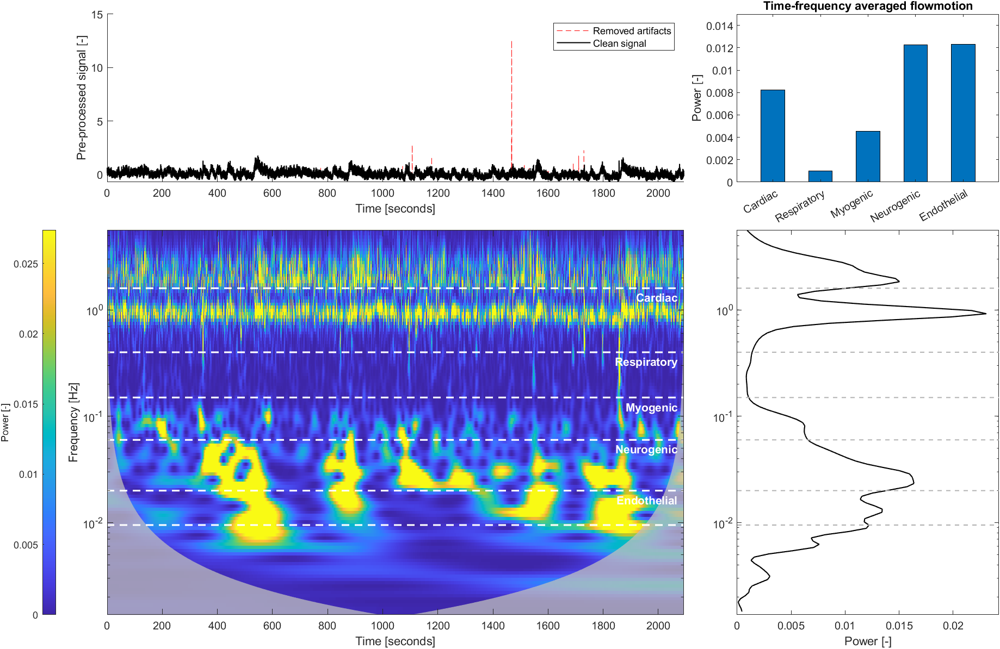
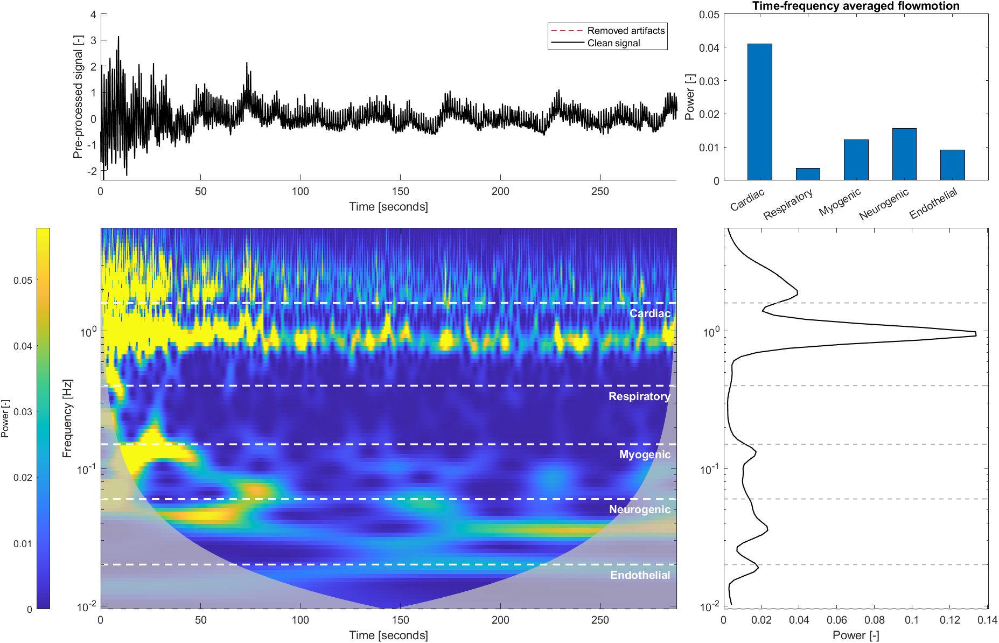

# Flowmotion analysis of microvascular measurements
This project is a library of Matlab functions for analyzing the periodic variations in measurements of microvascular parameters, so called flowmotion analysis. The technique is used in biomedical and clinical research to investigate the function of the microvascular regulation in response to different stimuli, such as blood pressure changes, temperature, and metabolic needs.

The project contains the following main features:
* Flowmotion analysis of steady-state signals, such as during normal resting conditions. ([Publication link](https://doi.org/10.1111/srt.13106))
* Flowmotion analysis of transient signals during post-occlusion recovery.
* Automatic detection and removal of motion artifacts to increase robustness. ([Publication link](https://doi.org/10.1016/j.mvr.2022.104456))
* Functions for visualizing the analysis and results.

## Table of contents
1. [Use and citation](#use-and-citation)
1. [Setup](#setup)
1. [Examples](#examples)
1. [Research](#research)
1. [Contact and contributions](#contact-and-contributions)
1. [License](#licence)

## Use and citation
This project is published under the MIT license and is free to download and use. If you use this software, please cite using the following plain-text format, or use the GitHub citation tool (found in right sidebar) to generate a citation file.

```
Flowmotion analysis of microvascular measurements; Martin Hultman, Marcus Larsson, Tomas Strömberg, Fredrik Iredahl, Ingemar Fredriksson; GitHub repository; Version 1.0.0; https://github.com/Martin-Hultman/Flowmotion
```

## Setup
To use this software, simply clone or download the repository and add the ```<repo-dir>/Functions``` folder to your Matlab path. Two example scripts are provided in the ```<repo-dir>/Scripts``` folder, demonstrating how to use the functions to process flowmotion in the provided example measurements in ```<repo-dir>/Example data```.

The code has been tested on Matlab R2024a and relies on the following toolboxes:
* Wavelet Toolbox
* Curve Fitting Toolbox

## Examples
This section describes some common use cases for this library. See the provided scripts for a more in-depth example.

### Flowmotion analysis of steady-state (baseline) signals
Flowmotion analysis has been most commonly used with steady-state (baseline) measurements where the mean level of the signal stays relatively unchanged over long time periods, with periodic oscillations around the mean. This library implements this analysis in a robust manner (see the [research](#research) section for details). The following code shows how to use the library functions to process a resting state signal and plot the flowmotion results.

```matlab
% Load data and related info
Data = load("<repo-dir>/Example data/ExampleBaseline.mat");
t  = Data.t;
X  = Data.X;
Fs = Data.Fs;

% Process the signal
FM = Flowmotion_ProcessSignal(t,X,Fs);
```

The return type ```FM``` is a struct containing the intermediate steps and final results of the flowmotion analysis. This struct can be used directly with the provided plot function to generate a figure summarizing the flowmotion results.

```matlab
% Plot flowmotion analysis and results
Flowmotion_PlotFlowmotion(FM);
```

For the example data in ```ExampleBaseline.mat```, this generates the following figure:



### Flowmotion analysis of transient post-occlusion signals
This project also implements the models and algorithms described in Ref 2 listed in the [research](#research) section. This allows applying the flowmotion analysis to signals measured during a post-occlusive reactive hyperemia provocation, a common experimental method used to investigate the microcirculation under a high oxygen demand. To use this feature, simply specify the signal type as ```"Reperfusion"``` in the call to ```Flowmotion_ProcessSignal```:

```matlab
% Load data and related info
Data = load("<repo-dir>/Example data/ExampleReperfusion.mat");
t  = Data.t;
X  = Data.X;
Fs = Data.Fs;

% Process the signal
FM = Flowmotion_ProcessSignal(t,X,Fs, "Type", "Reperfusion");

% Plot flowmotion analysis and results
Flowmotion_PlotFlowmotion(FM);
```

This code generates the following figure, which demonstrates the high vascular activity directly following the release of the occlusion:



## Research

The code in this project has been developed for research described primarily in the following publications, available open-access:

1. Vasomotion analysis of speed resolved perfusion, oxygen saturation, red blood cell tissue fraction, and vessel diameter: Novel microvascular perspectives\
Ingemar Fredriksson, Marcus Larsson, Tomas Strömberg, Fredrik Iredahl\
Skin Research and Technology, 2021\
https://doi.org/10.1111/srt.13106

1. Flowmotion imaging analysis of spatiotemporal variations in skin microcirculatory perfusion\
Martin Hultman, Marcus Larsson, Tomas Strömberg, Joakim Henricson, Fredrik Iredahl, Ingemar Fredriksson\
Microvascular Research, 2023\
https://doi.org/10.1016/j.mvr.2022.104456

1. Robust analysis of microcirculatory flowmotion during post-occlusive reactive hyperemia\
Martin Hultman, Freya Richter, Marcus Larsson, Tomas Strömberg, Fredrik Iredahl, Ingemar Fredriksson\
2024

## Contact and contributions
This repository is maintained by Martin Hultman, martin.o.hultman@liu.se. Contributions in the form of questions, suggestions, issues, and pull-requests are welcome.

## License
MIT License found [here](LICENSE).\
Copyright (c) 2024 Martin Hultman
